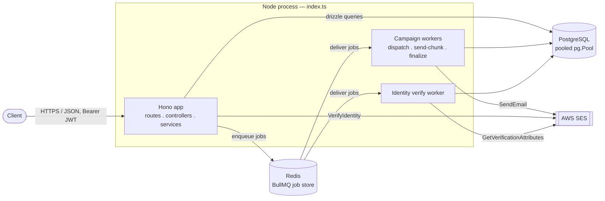
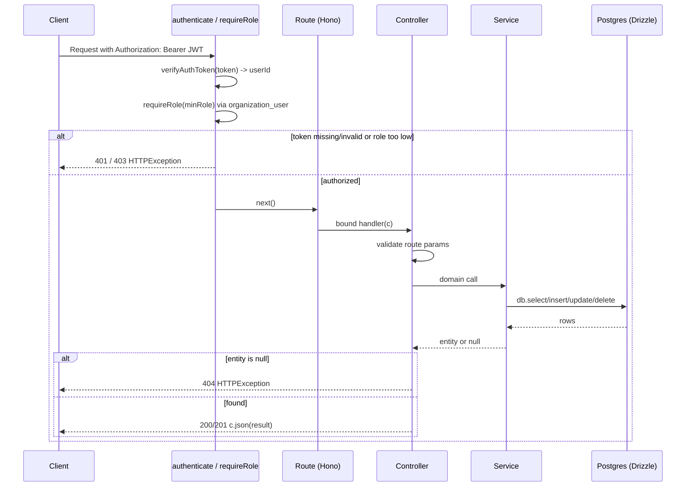
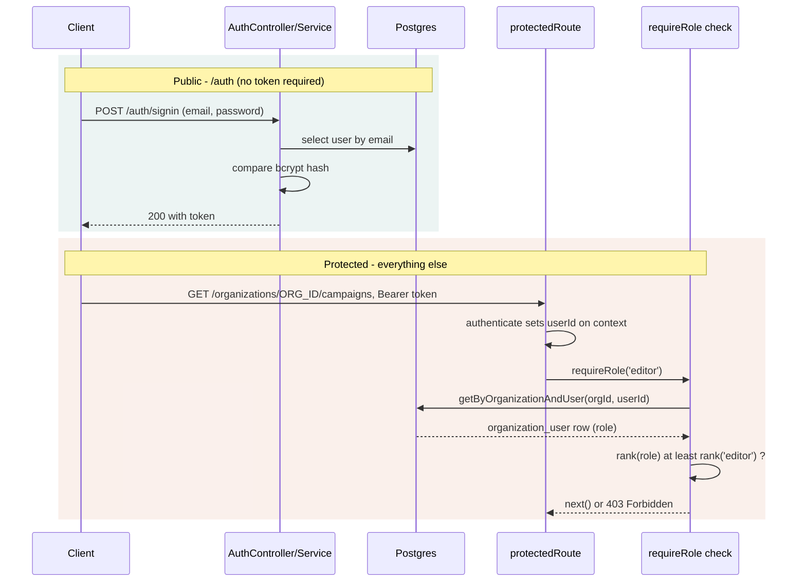
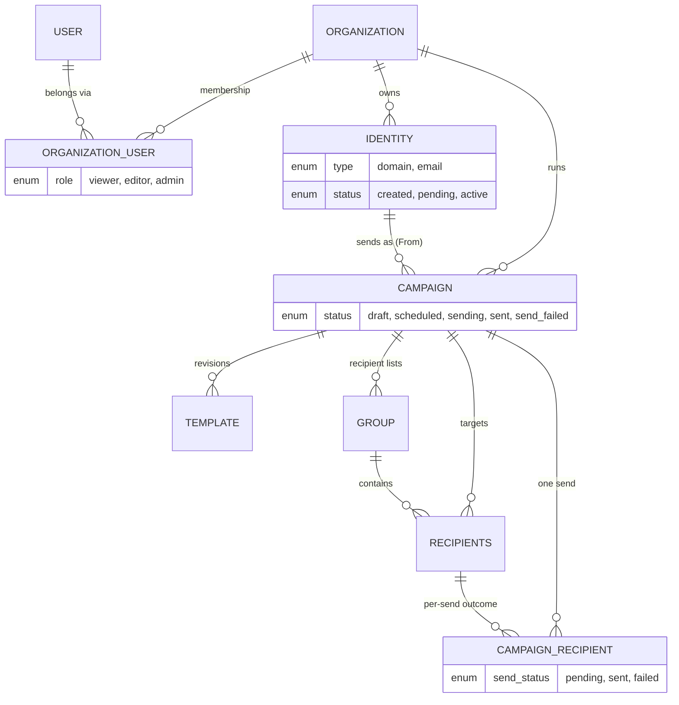
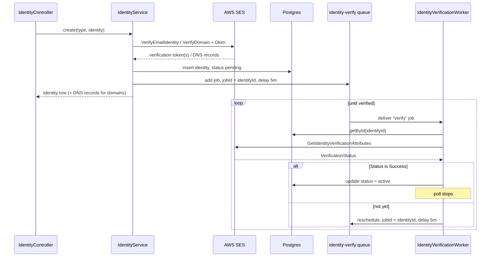
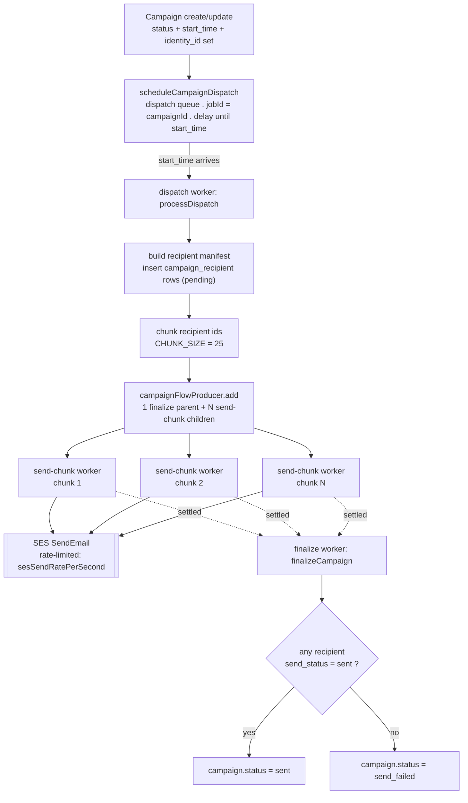

# Architecture diagrams

Companion to the [Architecture](../README.md#architecture) section of the README — the same flows, as diagrams.

## Contents

1. [System overview](#1-system-overview)
2. [Request flow](#2-request-flow)
3. [Auth &amp; access](#3-auth--access)
4. [Data model](#4-data-model)
5. [Identity verification](#5-identity-verification)
6. [Campaign send pipeline](#6-campaign-send-pipeline)

---

## 1. System overview

A single long-lived Node process serves HTTP and runs the BullMQ workers side by side, sharing one Postgres pool and one Redis connection.

**Notes**

- `connectDB()` runs `select 1` before `serve()` starts — an unreachable database stops the process instead of surfacing as request-time errors.
- `startCampaignWorkers()` / `startIdentityVerificationWorker()` are called directly from the root `index.ts`, reusing the same pg pool and Redis connection as the HTTP layer rather than a separate deployable.
- The pooled TCP client is a deliberate fit for a long-lived process — the pool is created once at boot and shared across every request instead of being opened per call.

## 2. Request flow

Every endpoint follows the same four-layer chain: routes are thin wiring, controllers translate HTTP ↔ domain and own the 400/404 decisions, services hold all business logic and Drizzle queries, and models are pure schema.

**Notes**

- Not-found is a return value, not a throw: services return `null` for "no match"; only the controller — the HTTP-aware layer — turns that into a `404 HTTPException`.
- Services never see Hono's `Context`. No `HTTPException`, no `c.req`/`c.json` below the controller — keeps business logic callable from both HTTP handlers and BullMQ job processors (see §6).
- Controllers don't wrap DB calls in try/catch; anything unexpected is caught once, globally, by `errorHandler` and returned as a generic 500.
- Each `*Route.ts` constructs its service/controller once at module scope; arrow-function class methods keep `this` bound so the same instances are safely reused across every request.

## 3. Auth & access

`/auth` is the only route group that skips authentication. Everything else sits behind two independent checks: who you are, then what you're allowed to do in *this* organization.

**Notes**

- Role lives on the join row, not the user: `organization_user.role` (`viewer` < `editor` < `admin`) is per-membership — the same person can be `admin` in one organization and `viewer` in another.
- `.use('*', authenticate)` is attached to `protectedRoute` before any `.route(...)` is mounted on it, since a matched handler never falls through to middleware registered after it.
- `requireSelf` guards `/users/:id` profile edits by comparing the route param to `c.get('userId')` — no organization membership needed to edit your own record.

## 4. Data model

`organization` is the tenant root. Nearly every table carries `organization_id`; the one exception is `user`, which is many-to-many with `organization` through the `organization_user` join row — which is also where the per-organization `role` lives.

**Notes**

- `campaign_recipient` is an audit trail, not a mutation: a send creates one row per recipient per send; the underlying `recipients` row is never touched, so the same recipient stays reusable across future campaigns.
- Templates are revisions, not slots: a campaign can hold several `template` rows; `SendCampaignService` picks "the" one to send by `updated_at desc` — there's no `is_final` flag today.
- Every row id is an app-generated UUID string (`varchar`, not Postgres's native `uuid` type), kept consistent so FK columns match without a cast.

## 5. Identity verification

SES verification is asynchronous and open-ended — a domain owner may take arbitrarily long to add DNS records. Rather than a cron sweep, each identity drives its own BullMQ job that reschedules itself until SES confirms.

**Notes**

- The SES call happens before the DB insert. If `VerifyEmailIdentityCommand`/`VerifyDomainIdentityCommand` throws, nothing is written — no orphaned `identity` row pointing at an unregistered SES identity.
- Job id equals entity id: reusing `identityId` as the BullMQ `jobId`, combined with `removeOnComplete`/`removeOnFail`, means the worker's self-requeue can never collide with a still-pending job.
- No attempt cap — unlike the campaign pipeline, this poll has no retry ceiling. It stops only when SES confirms or the identity row is deleted (the worker checks and exits).

## 6. Campaign send pipeline

A scheduled campaign is one delayed BullMQ job. When it fires, the dispatch worker builds the recipient manifest and hands it to a `FlowProducer`, which fans the send out into rate-limited chunk jobs that all report back to a single finalize job.

**Notes**

- Rescheduling is idempotent by design: `scheduleCampaignDispatch` reuses `jobId = campaignId`; editing a campaign's `start_time` removes and re-adds the same job instead of creating a duplicate — but only while it's still `delayed`/`waiting`. An already-firing job is left alone.
- A stuck chunk can't block the campaign: chunk jobs carry `ignoreDependencyOnFailure`, so a chunk that exhausts all 5 retries still lets the finalize parent run rather than hanging the whole send.
- Chunk jobs re-fetch everything fresh: `sendChunk` re-reads the campaign, identity, and template by id rather than trusting the job payload, and skips recipients already marked `sent`, so a BullMQ retry of a partially-sent chunk is safe.
- Partial delivery isn't total failure: `finalizeCampaign` only marks `send_failed` when *zero* recipients succeeded — routine per-recipient bounces don't flip the whole campaign's status; `campaign_recipient.send_status` is the accurate per-recipient record.
- Queue-orchestration stays out of the service layer: `CampaignWorkers.ts` owns the `FlowProducer` wiring; `SendCampaignService` never imports from `src/queues/`, so it stays callable and testable independent of BullMQ.
